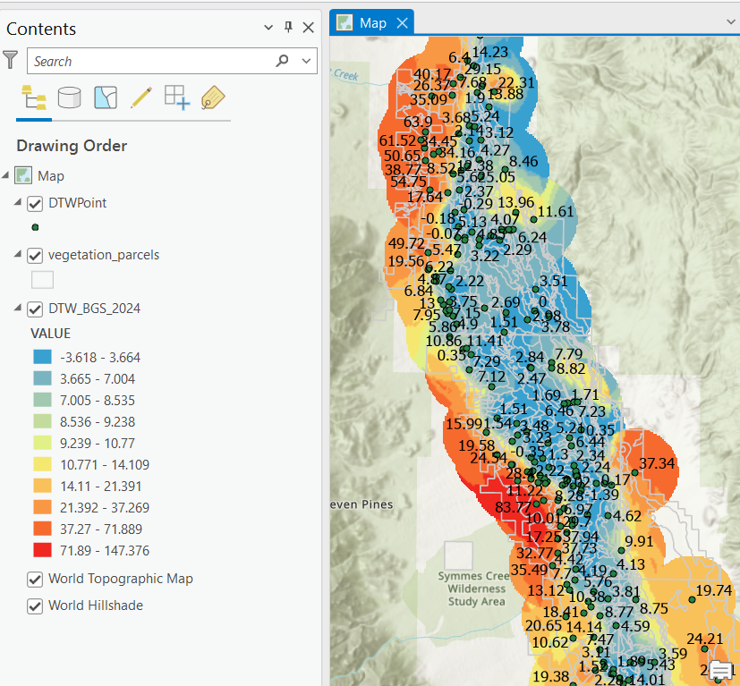
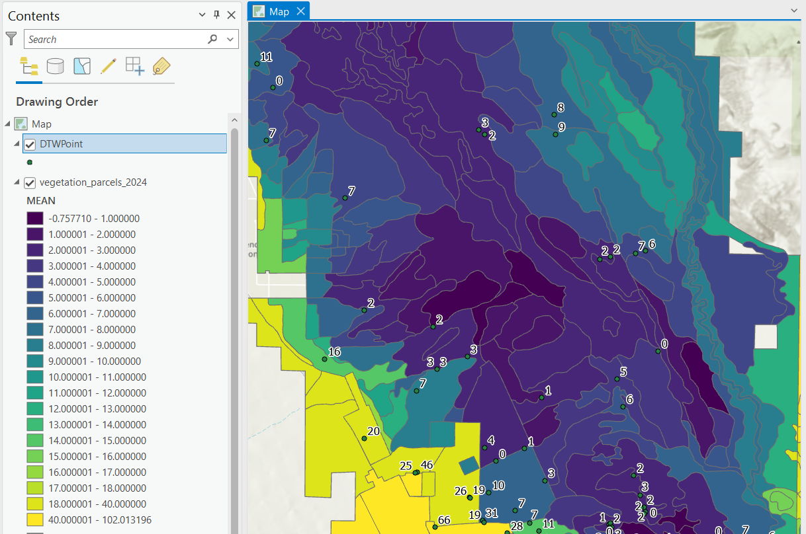

# Kriging Depth to Water (DTW)

This project involves 1) creating depth to water (DTW) raster surfaces using empirical Bayesian kriging and 2) averaging raster cell values within vegetation polygons using arcpy zonal statistics. The results can be exported to a CSV file and visualized in ArcGIS Pro.

## Getting Started

### Prerequisites

- ArcGIS Pro
- Conda

### Installation

1. **Clone the repository:**
    ```sh
    git clone https://github.com/your-username/kriging-dtw.git
    cd kriging-dtw
    ```

2. **Create and activate a new conda environment from ArcGIS Pro:**
    - Open ArcGIS Pro and go to the `Project` tab, then select `Python`.
    - Click the Clone button and set the name to `kriging-dtw`.
    - The destination path should be something like:
      ```text
      C:\Users\znelson\AppData\Local\ESRI\conda\envs\kriging-dtw
      ```

3. **Activate the environment in the terminal:**
    ```sh
    conda activate C:\Users\znelson\AppData\Local\ESRI\conda\envs\kriging-dtw
    ```

4. **Install the required Python packages:**
    ```sh
    pip install -r requirements.txt
    ```

5. **Open the project folder in VSCode:**
    - Ensure the environment `kriging-dtw` is activated automatically.

### Configuration

Edit the `config.ini` file to specify your paths, years, kriging parameters, and zonal statistics settings.

Example `config.ini`:

```ini
[settings]
# Assuming the scripts are run from the project root directory
base_path = .  
# single year
years = 2024  

# range of years
#years = 1990-2020  

# list of years
#years = 1990,1995,2000,2005,2010,2015,2020 

[kriging_parameters]
cell_size = 100
transformation_type = EMPIRICAL
max_local_points = 50
overlap_factor = 1.1
number_semivariograms = 100
search_neighborhood = NBRTYPE=StandardCircular;RADIUS=2500;ANGLE=330;NBR_MAX=4;NBR_MIN=0;SECTOR_TYPE=FOUR_SECTORS
output_type = PREDICTION
quantile_value = 0.5
threshold_type = EXCEED
probability_threshold = None
semivariogram_model_type = K_BESSEL_DETRENDED

[zonal_statistics]
parcel_feature_class = kriging.gdb/vegetation_parcels
parcel_database = kriging.gdb/parcel_dtw_stats
```

### Usage

1. **Run the kriging model for a specified year or range of years:**
    ```sh
    python kriging_dtw.py --config ./config.ini
    ```

2. **Run the zonal statistics script:**
    ```sh
    python zonal_stats.py --config ./config.ini
    ```

### Output

- **Raster Files**: The kriging script generates raster files for each year specified in the configuration.
- **Zonal Statistics CSV**: The zonal statistics script generates CSV files containing the summarized depth to water for each polygon.
- **New Parcel Layer**: The zonal statistics script creates a new parcel layer with the DTW statistics joined, saved in the `kriging.gdb`.

### Visualizations

#### Kriged Surface


#### Parcels Color Coded by Zonally Averaged DTW


### Contributing

Please read [CONTRIBUTING.md](CONTRIBUTING.md) for details on the process for submitting pull requests to us.

### License

This project is licensed under the MIT License - see the [LICENSE](LICENSE) file for details.
